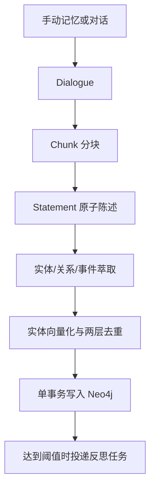

# 三元组萃取与四层溯源图谱

Echo 将手动记忆或对话内容异步转换为实体、关系和事件，并写入 Neo4j。

## 写入流程



## 图结构

```text
Dialogue -[:HAS_CHUNK]-> Chunk
Chunk -[:HAS_STATEMENT]-> Statement
Statement -[:MENTIONS]-> Entity
Entity -[:RELATION]-> Entity
Event -[:INVOLVES]-> Entity
Insight -[:DERIVED_FROM]-> Entity
```

溯源层回答“这条记忆从哪里来”，语义层回答“实体之间是什么关系”。删除或纠错时按图关系清理派生节点，不依赖文本包含判断。

## 画像与事件

- 画像类记忆保存为 Entity 和 RELATION，例如偏好、职业、人物关系。
- 事件类记忆保存为 Event 和 INVOLVES，并保留 `event_time` 进入时间线。

## 去重与幂等

实体先做批内去重，再与已有图谱实体融合。抽取阶段使用局部 id，占位关系在去重完成后统一重定向到最终实体 id。Neo4j 写入使用 `UNWIND + MERGE` 和唯一约束，使 Celery 重试不会产生重复节点。

面试问答：

**Q：为什么要先抽 Statement 再抽三元组？**

A：原子陈述把长文本拆成“一句一个事实”，减少漏抽、多事实粘连和指代混乱，同时让每个实体可以追溯到具体语句。

**Q：为什么不只保存实体和关系？**

A：没有 Dialogue、Chunk、Statement 就无法解释来源，也难以安全删除错误记忆。溯源是人工纠错和可靠性评分的基础。
